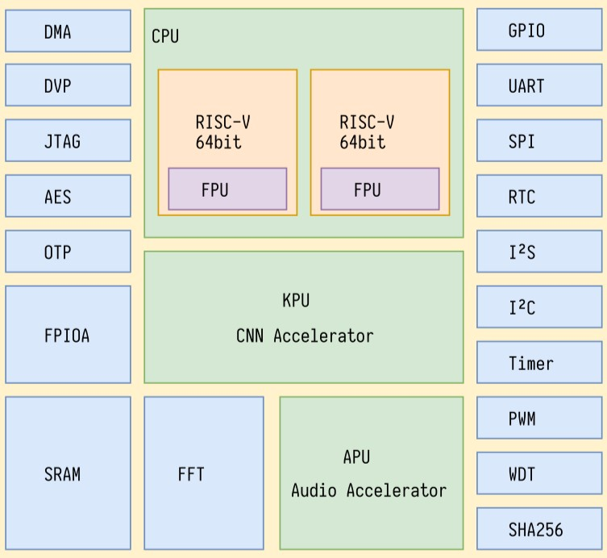

# [K210](https://github.com/SoCXin/K210)

* [Kendryte](https://canaan-creative.com): [RV64](https://github.com/SoCXin/RISC-V)
* [L6R5](https://github.com/SoCXin/Level): 400 MHz (2778 CoreMark,1177 DMIPS)

## [简介](https://github.com/SoCXin/K210/wiki)

2018年发布，TSMC 28nm工艺，Kendryte K210自身功耗仅为0.3W，即便搭载摄像头等外部设备，其功耗也仅为1W左右。对标Google Edge TPU,发布会报价3$。

以CoreMark测试程序为例，RISC-V BOOM的程序运行时间为14.26秒，而其他RISC指令集处理器的程序运行时间则为18.15秒。且RISC-V BOOM无论在总指令数、CPI还是时钟周期上均低于其他RISC指令集处理器，更为敏捷。

### 关键特性

* RISC-V Dual Core 64bit with FPU
* 神经网络处理器（KPU）
* 麦克风阵列处理（APU）
* 封装(BGA144 8mmx8mmx0.953mm)

### [资源收录](https://github.com/SoCXin)

* [参考资源](src/)
* [参考文档](docs/)
* [参考工程](project/)
* [入门教程](https://docs.soc.xin/K210)

### [选型建议](https://github.com/SoCXin)

[K210](https://github.com/SoCXin/K210) 性价比是非常高，在拥有几个大件外设情况下，除了小封装外，几乎没给STM32F4留多少机会。

### [探索芯世界 www.SoC.xin](http://www.SoC.Xin)
